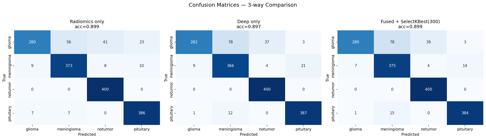
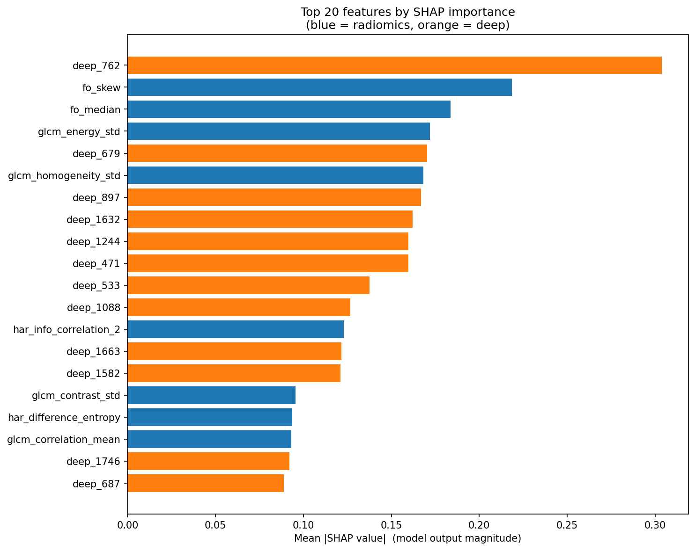
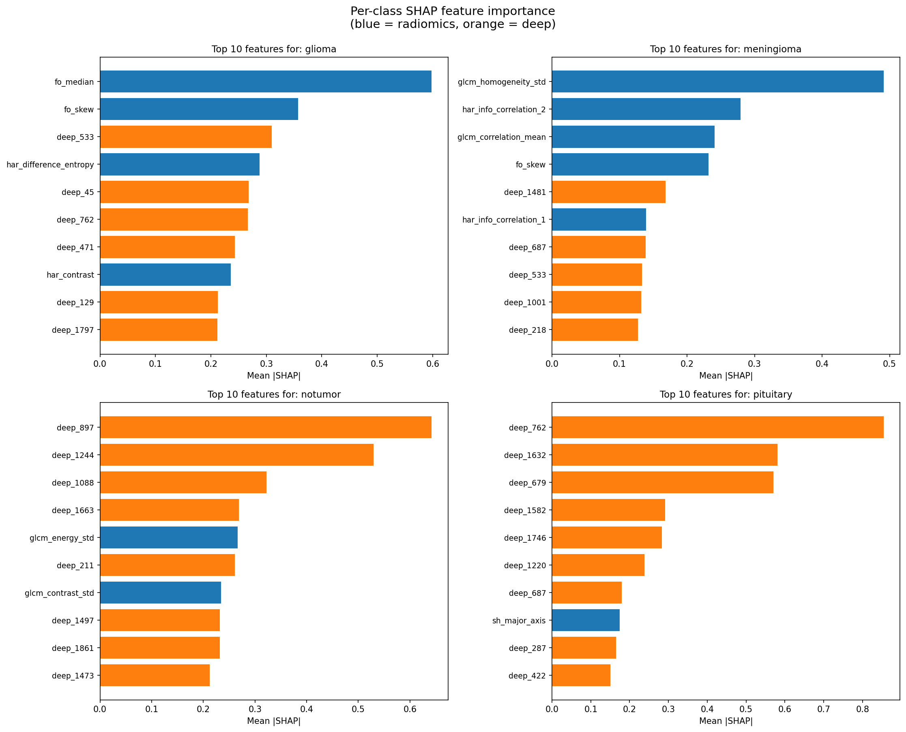

# 🧠 Brain Tumor MRI Classification: Hybrid Radiomics + Deep CNN Feature Fusion

An interpretable, reproducible study comparing hand-crafted radiomics features, pretrained ResNet50 deep features, and their fusion for 4-class brain tumor classification on T1-weighted MRI scans. Includes SHAP interpretability analysis, case-based retrieval for prediction validation, and an interactive Streamlit demo.

**Author:** Aikel Indurkhya | **Project type:** PG mid-semester biomedical data science project | **Timeline:** 7 days

---

## 📊 Headline Results

| Model | Features | Test Accuracy | Macro-F1 |
|---|---|---|---|
| Radiomics only (XGBoost) | 47 | 89.94% | 0.8955 |
| Deep only (XGBoost) | 2048 | 89.69% | 0.8939 |
| **Fused + SelectKBest(300) + XGBoost** | **300** | **89.94%** | **0.8965** |

**Dataset:** Nickparvar Brain Tumor MRI (Kaggle) — 7,200 images, 4 classes (glioma, meningioma, pituitary, notumor), 5,600 train / 1,600 test.



---

## 🔑 Key Findings

1. **Both feature types reach ~90% individually; fusion provides marginal but consistent macro-F1 improvement** (0.8955 → 0.8965). The dataset appears near its ceiling for non-end-to-end methods.
2. **Glioma is the hardest class** (recall: 0.70) due to whole-brain masks averaging out tumor heterogeneity. Most glioma errors confuse with meningioma.
3. **Deep features specifically reduce glioma↔pituitary confusion** (from 23 errors to 3). Radiomics features handle texture-based separation better.
4. **Random Forest is unsuitable for raw 2048-d deep features** (85.69% with RF vs 90.00% with Logistic Regression). XGBoost handles both feature types well.
5. **Aggressive feature selection hurts:** SelectKBest(80) drops accuracy by 0.75%; k=300 or no selection is optimal.

---

## 🏗️ Pipeline Architecture
MRI Image (any size, grayscale)
│
▼
Brain Crop + CLAHE + Resize (224×224)
│
├─────────────────────┬─────────────────────┐
▼                     ▼                     ▼
Brain Mask            Frozen ResNet50      [Both for fusion]
(Otsu + morph)        (ImageNet weights)
│                     │
▼                     ▼
Radiomics (47-d)      Deep features (2048-d)

13 first-order
12 GLCM
13 Haralick
9 shape
│                     │
└────── Concatenate ──┘
│
▼
StandardScaler
│
▼
SelectKBest (k=300, ANOVA F)
│
▼
XGBoost (n=400, depth=6)
│
▼
Predicted class + probabilities
│
▼
SHAP explanation + Similar-case retrieval
---

## 🔬 Interpretability (SHAP)

The fused model's top predictive features split roughly equally between radiomics and deep features:



**Per-class top features** (from SHAP analysis):
- **Glioma:** `fo_median`, `fo_skew`, `deep_533` — intensity statistics dominate
- **Meningioma:** `glcm_homogeneity_std`, `har_info_correlation_2`, `glcm_correlation_mean` — pure texture
- **Notumor:** `deep_897`, `deep_1244`, `deep_1088` — deep features fully drive
- **Pituitary:** `deep_762`, `deep_1632`, `deep_679` — deep features fully drive

Different tumor types rely on different feature subsets — radiomics distinguishes meningioma's homogeneous texture, while deep features identify the more abstract patterns of healthy brain and pituitary tumors.



---

## 🚀 Live Demo (Streamlit)

The included Streamlit app provides:
- Upload-and-predict interface for any brain MRI image
- Side-by-side comparison of all 3 models (radiomics-only, deep-only, fused)
- **Calibrated confidence indicators** (high/medium/low with radiologist-review flag)
- **Case-based retrieval** — shows the 3 most similar training images in feature space, validating the prediction against training data

```bash

streamlit run app/streamlit_app.py
This case-based retrieval acts as a **prediction validator**: when all 3 retrieved cases match the predicted class, the prediction is well-supported. When they don't, the prediction is likely unreliable.

---

## 📁 Repository Structure
brain_tumor_fusion/
├── notebooks/
│   ├── 01_explore.ipynb           # Dataset exploration
│   ├── 02_preprocess.ipynb        # Brain cropping + CLAHE + resize
│   ├── 03_masks.ipynb             # Brain mask generation
│   ├── 04_radiomics.ipynb         # 47 radiomics features
│   ├── 05_deep_features.ipynb     # 2048-d ResNet50 features
│   ├── 06_classify.ipynb          # 3-way XGBoost comparison
│   ├── 07_shap.ipynb              # SHAP interpretability
│   ├── 08_demo.ipynb              # Demo / inference notebook
│   └── 09_build_similarity_index.ipynb  # CBIR index construction
├── app/
│   └── streamlit_app.py           # Web demo
├── models/
│   ├── radiomics.pkl              # Radiomics-only model
│   ├── deep.pkl                   # Deep-only model
│   ├── fused.pkl                  # Fused model (final)
│   └── similarity_index.pkl       # Training feature index for CBIR
├── outputs/
│   ├── confusion_matrices.png
│   ├── feature_importance.png
│   ├── shap_global.png
│   ├── shap_per_class.png
│   ├── results_table.csv
│   └── results_table_full.csv
├── features/                      # gitignored (CSVs regenerable)
├── data/                          # gitignored (Kaggle dataset)
└── README.md

---

## ⚙️ How to Reproduce

### Setup environment

```bash
conda create -n brain_tumor python=3.11
conda activate brain_tumor
pip install numpy opencv-python scikit-image mahotas scikit-learn pandas matplotlib seaborn xgboost shap torch torchvision jupyter tqdm streamlit joblib
```

### Get the dataset

Download from Kaggle: [Brain Tumor MRI Dataset by Masoud Nickparvar](https://www.kaggle.com/datasets/masoudnickparvar/brain-tumor-mri-dataset). Extract into `data/raw/` so structure is `data/raw/Training/{class}/` and `data/raw/Testing/{class}/`.

### Run notebooks in order

```bash
jupyter notebook
```

Run `01` through `09` sequentially. Each saves intermediate artifacts the next one needs.

### Launch the demo

```bash
streamlit run app/streamlit_app.py
```

---

## ⚠️ Limitations

1. **Whole-brain masks, not tumor masks.** The dataset doesn't provide tumor segmentations, so we use the whole brain as the ROI. This averages out tumor heterogeneity and is the primary reason for glioma's lower recall.
2. **Single dataset.** Cross-dataset generalization (e.g., to BraTS or Cheng J. Figshare datasets) was not tested due to time constraints.
3. **Frozen ResNet50, no fine-tuning.** ImageNet features may not be optimal for medical imaging. End-to-end CNN training would likely improve absolute accuracy but lose interpretability.
4. **`deep_897` dominance.** A single deep feature contributes ~12% of model importance. Stability across cross-validation folds and different backbones (EfficientNet, DenseNet) was not investigated.
5. **CPU-only inference.** Trained on a laptop without GPU. Acceptable here because we use frozen features + classical ML, but limits scalability.

---

## 🔮 Future Work

- **Tumor segmentation** with nnU-Net or SAM to replace whole-brain masks; expected to significantly improve glioma performance
- **Cross-dataset validation** on BraTS and Cheng J. Figshare datasets to assess generalization
- **Stacked ensemble** as an alternative fusion strategy (separate models + meta-classifier)
- **Stability analysis** of `deep_897` across CV folds and different ImageNet backbones
- **Calibration metrics** (Expected Calibration Error, reliability diagrams) on the confidence scores

---

## 📚 References

1. Aerts, H. J. W. L. et al. (2014). *Decoding tumor phenotype by noninvasive imaging using a quantitative radiomics approach.* Nature Communications, 5, 4006.
2. van Griethuysen, J. J. M. et al. (2017). *Computational Radiomics System to Decode the Radiographic Phenotype.* Cancer Research, 77(21).
3. Lao, J. et al. (2017). *A Deep Learning-Based Radiomics Model for Prediction of Survival in Glioblastoma Multiforme.* Scientific Reports, 7, 10353.
4. Lundberg, S. M. & Lee, S.-I. (2017). *A Unified Approach to Interpreting Model Predictions.* NeurIPS.
5. Raghu, M. et al. (2019). *Transfusion: Understanding Transfer Learning for Medical Imaging.* NeurIPS.

---

## 🛠️ Tech Stack

Python 3.11 | PyTorch | scikit-image | mahotas | scikit-learn | XGBoost | SHAP | Streamlit | matplotlib

---

## 📜 License & Citation

This is a coursework project. Not a medical device. **Not intended for clinical use.**

If you reference this work: *Indurkhya, A. (2026). Hybrid Radiomics + Deep CNN Feature Fusion for Brain Tumor Classification on MRI. Coursework project.*